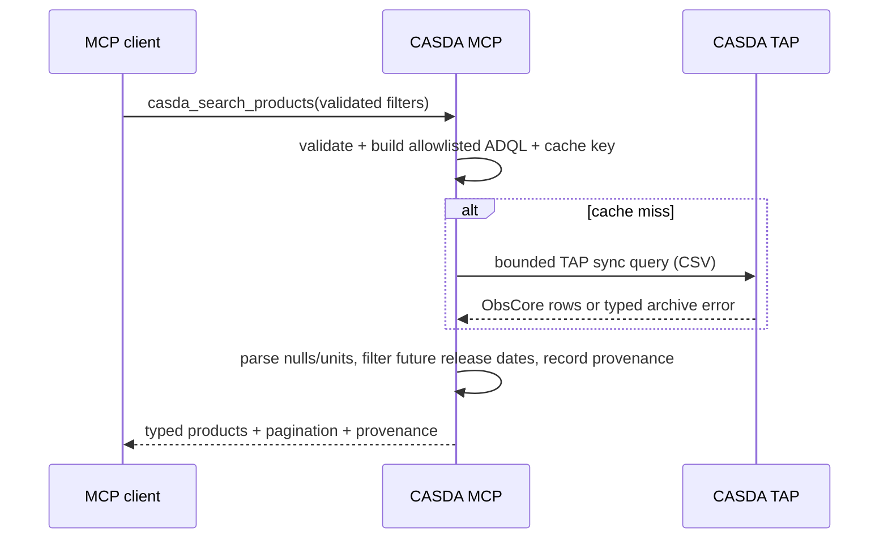

# Architecture

## Components

| Module | Responsibility |
| --- | --- |
| `server.py` | Stable MCP tool/resource names, descriptions, input/output schemas, transport app, health. |
| `service.py` | Workflow orchestration, limits, idempotency, per-product state, provenance, manifests. |
| `query.py` | Validation and allowlisted TAP/ADQL construction; no generic query entry point. |
| `client.py` | Pooled async HTTP, OPAL Basic auth, retry boundaries, redirects, host/rate-limit handling. |
| `parsers.py` | CSV, Astropy VOTable, and defused UWS XML parsing into deterministic typed values. |
| `downloads.py` | Destination containment, checksum parsing, streaming, Range retry, atomic completion. |
| `state.py` | In-memory or opt-in SQLite idempotency, staging, ready URL, search, and manifest state. |
| `cache.py` | Bounded process-local TTL cache for successful read-only TAP results. |
| `models.py` | Stable Pydantic MCP boundary and internal protocol models. |
| `provenance.py` | Canonical hashes, URL sanitisation, recursive redaction, timestamps/correlation IDs. |
| `observability.py` | JSON stderr logs and non-sensitive process-local counters. |
| `config.py` | Typed environment configuration and fail-fast security validation. |

## Search sequence



## Staging and status sequence

```mermaid
sequenceDiagram
    participant AI as MCP client
    participant MCP as CASDA MCP
    participant TAP as CASDA TAP
    participant DL as CASDA Datalink
    participant SODA as CASDA SODA/UWS
    AI->>MCP: casda_stage_products(explicit IDs, idempotency key)
    MCP->>MCP: deduplicate + enforce count/size + detect active duplicate
    MCP->>TAP: exact product metadata
    MCP->>DL: authenticated Datalink read per product
    DL-->>MCP: async service + opaque authenticated IDs
    MCP->>SODA: create one job (never auto-retried)
    SODA-->>MCP: archive job URL/identifier
    MCP->>SODA: phase=RUN (never auto-retried)
    MCP-->>AI: confirmed request ID and current phase
    Note over AI,MCP: No background polling
    AI->>MCP: casda_get_staging_status(request ID)
    MCP->>SODA: one uncached UWS GET
    SODA-->>MCP: phase, expiry, errors, result URLs
    MCP->>MCP: match filenames; record only exact ready products
    MCP-->>AI: overall + per-product state
```

## Download transaction

1. Require the download feature flag and exact product ID.
2. Require a non-expired ready artifact established by a completed UWS status response.
3. Re-read product metadata and enforce estimated and archive-reported byte limits.
4. Resolve the caller path under the configured absolute directory; reject traversal and existing
   files unless replacement was administratively enabled.
5. Fetch and parse the checksum sidecar when available and requested.
6. Stream to a unique temporary file. A transient read may retry with `Range` from the confirmed
   temporary size; an ignored Range response restarts the same call safely.
7. Verify response Content-Length, final size, and checksum.
8. Atomically replace the target, confirm it is a file, then return its path.
9. On any failure, remove the incomplete temporary file.

## Retry and consistency boundaries

Safe TAP reads, Datalink reads, UWS status reads, checksum reads, and file GETs may retry transient
network, 429, or 5xx failures. Backoff is exponential with jitter and honors bounded `Retry-After`.
SODA job creation and phase start are not retried because a lost response could conceal a successful
state change. Caller and generated idempotency keys prevent known duplicate submissions at the
service boundary but cannot make an ambiguous upstream request response safe to replay.

## State and cache

Metadata cache state is never used for UWS status. Credentials and authentication failures are never
cached. Default staging/manifest state is memory-only. SQLite persistence is opt-in and allows
restart continuity but stores the job URL and any short-lived signed result URLs, so the database is
sensitive local state and requires OS protection.

## WALLABY boundary

Generic CASDA metadata represents WALLABY fields when CASDA supplies them. No source-product inference
is hard-coded. A future adapter belongs above `CasdaService` and must define testable source-name,
footprint, beam, neighbor, version, and product-selection rules before adding a dedicated tool.
