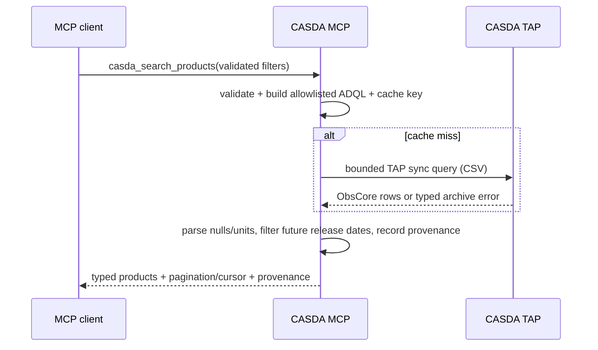
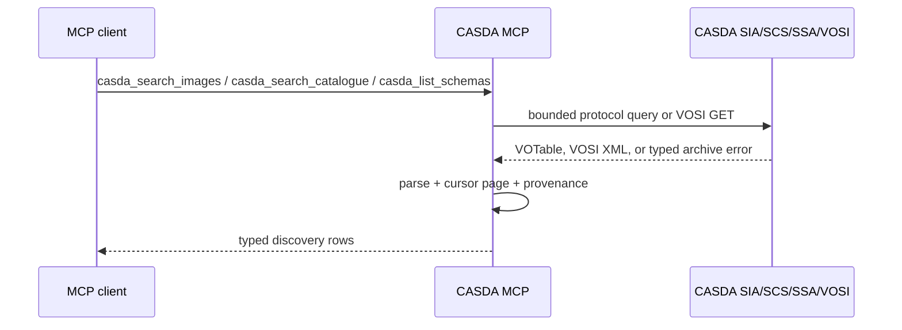
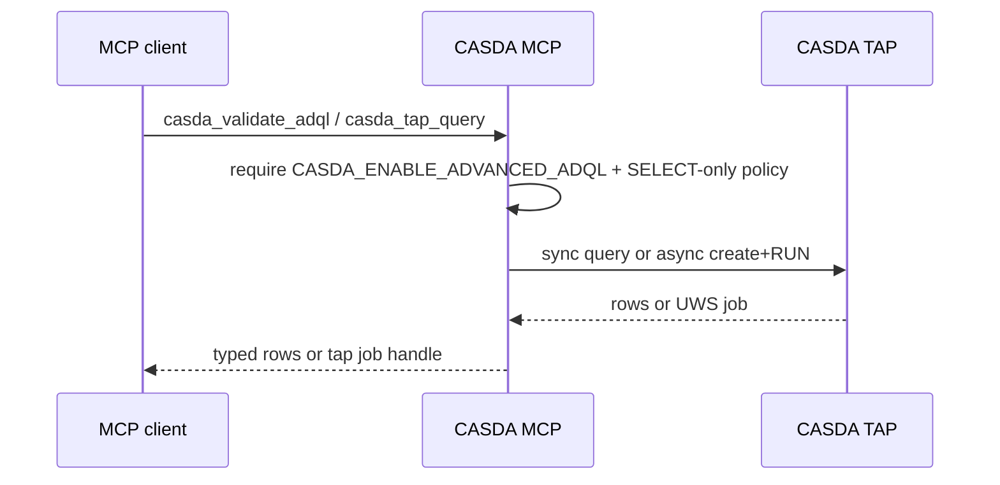

# Architecture

## Components

| Module | Responsibility |
| --- | --- |
| `server.py` | Stable MCP tool/resource/prompt names, descriptions, input/output schemas, transport app, `/healthz` and `/readyz`. |
| `skills_loader.py` | Packaged `SKILL.md` discovery via importlib resources; skill index and validation. |
| `skills/*/SKILL.md` | Canonical agent skill markdown shipped in the wheel and mirrored to `.cursor/skills/`. |
| `service.py` | Workflow orchestration, limits, idempotency, per-product state, provenance, manifests. |
| `query.py` | Validation and allowlisted TAP/ADQL construction for safe discovery helpers. |
| `adql.py` | SELECT-only ADQL validation and bounds for the optional advanced TAP surface. |
| `vosi.py` | VOSI availability and capabilities XML parsing into typed archive status models. |
| `cursor.py` | Opaque, hash-bound pagination cursors for large discovery responses. |
| `client.py` | Pooled async HTTP, bounded decoded reads, OPAL auth, redirects, retry/host handling. |
| `parsers.py` | CSV, Astropy VOTable, defused UWS/DataLink XML, and event-feed parsing. |
| `downloads.py` | Destination containment, checksum parsing, streaming, Range retry, atomic completion. |
| `state.py` | In-memory or opt-in SQLite idempotency, staging, ready URL, search, and manifest state. |
| `cache.py` | Bounded process-local TTL cache for successful read-only TAP results. |
| `models.py` | Stable Pydantic MCP boundary and internal protocol models. |
| `provenance.py` | Canonical hashes, URL sanitisation, recursive redaction, timestamps/correlation IDs. |
| `observability.py` | JSON stderr logs and non-sensitive process-local counters. |
| `config.py` | Typed environment configuration and fail-fast security validation. |

## Search sequence



## VO discovery sequence



## Advanced ADQL sequence



## Staging and status sequence

```mermaid
sequenceDiagram
    participant AI as MCP client
    participant MCP as CASDA MCP
    participant TAP as CASDA TAP
    participant DL as CASDA Datalink
    participant SODA as CASDA SODA/UWS
    AI->>MCP: casda_stage_products / casda_create_cutout / casda_create_spectrum
    MCP->>MCP: deduplicate + enforce count/size + detect active duplicate
    MCP->>TAP: exact product metadata
    MCP->>DL: authenticated Datalink read per product
    DL-->>MCP: async/cutout/spectrum service + opaque authenticated IDs
    MCP->>SODA: create one job (never auto-retried)
    SODA-->>MCP: archive job URL/identifier
    MCP->>SODA: phase=RUN (never auto-retried)
    MCP-->>AI: confirmed request ID and current phase
    Note over AI,MCP: No background polling
    AI->>MCP: casda_get_data_job or casda_get_staging_status
    MCP->>SODA: one uncached UWS GET
    SODA-->>MCP: phase, expiry, errors, identified results
    MCP->>MCP: match unique UWS IDs; atomically record ready products
    MCP-->>AI: overall + per-product state
```

## Download transaction

1. Require the download feature flag and exact product ID (or job-result selection).
2. Require a non-expired ready artifact established by a completed UWS status response.
3. Re-read product metadata and enforce estimated and archive-reported byte limits.
4. Canonicalise and identity-check the configured absolute, non-root, owner-controlled directory;
   reject non-sticky writable ancestors, traversal, case aliases of reserved internal names,
   symlinks, and existing files unless regular-file replacement was administratively enabled.
5. Atomically reserve a hash of the target in the private `.casda-mcp/locks` namespace and recheck
   the target before any checksum or file request.
6. Fetch and parse at most 64 KiB from the checksum sidecar when available and requested.
7. Stream identity-encoded raw bytes through a descriptor bound to the original inode of a unique same-directory
   temporary file. Resume with `Range` and `If-Range` only after a strong ETag or an RFC-strong
   Last-Modified was observed; otherwise truncate and restart from byte zero. A full `200` after a
   ranged request also replaces all partial bytes.
8. Verify strict Content-Range arithmetic, response Content-Length, final size, and checksum.
9. Publish with an atomic no-clobber link, or `os.replace` only when regular-file replacement was
   explicitly enabled; confirm the result is a regular file.
10. Sync and publish the verified inode, then remove its temporary name and reservation. A process
    crash can leave a safe stale hashed reservation requiring operator inspection.

## Retry and consistency boundaries

Safe TAP reads, Datalink reads, UWS status reads, checksum reads, and file GETs may retry transient
network, 408, 425, 429, or 5xx failures. Backoff is exponential with jitter and honors bounded
`Retry-After`.
SODA/TAP job creation and phase start are not retried because a lost response could conceal a successful
state change. Caller and generated idempotency keys prevent known duplicate submissions at the
service boundary but cannot make an ambiguous upstream request response safe to replay.

## State and cache

Metadata cache state is never used for UWS status. Credentials and authentication failures are never
cached. Default staging/manifest state is memory-only. SQLite persistence is opt-in and allows
restart continuity but stores the job URL and any short-lived signed result URLs, so the database is
sensitive local state and requires OS protection.

Process-local credentials, caches, job state, ready URLs, and manifests are not isolated across
remote MCP principals inside one process. For remote multi-user deployments, run one server process
per principal (or an equivalent authenticating front end that never multiplexes principals onto a
shared process).

## WALLABY boundary

Generic CASDA metadata represents WALLABY fields when CASDA supplies them. No source-product inference
is hard-coded. A future adapter belongs above `CasdaService` and must define testable source-name,
footprint, beam, neighbor, version, and product-selection rules before adding a dedicated tool.
